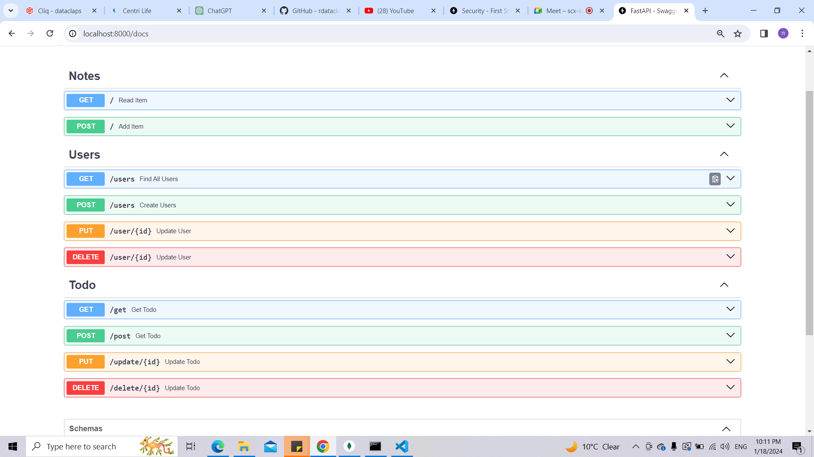

# fastapi-advanced

Creating an project on fastapi
Using Mongodb
Using Static and template files in it 

Till now i have created a navbar in index.html and a form and getting data from database.

Adding data from frontend is not complete yet will complete it soon.

Now we are able to insert data from frontend too.

Today i have created apis for creating new user and get all user
we are able to add the user but we are not getting response as expected so will work on this.

Now we are able to add, update, delete and get all users.

Created apis for managing todo list, it that we can  get all the list for todos and we can add too
Added update and delete api of todo
